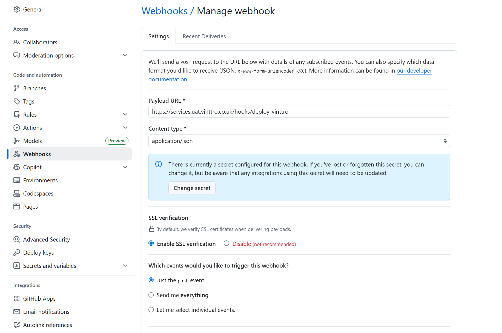

# VINTTRO Code deployment

### Overview
This document describe the deployment process for the bespoke VINTTRO code, 


### Git hub triggers
Currently deploying from git hub via a webhook onto the vm, where the vm is running a webhook service that is exposed via the nginx server.
---

### UAT
#### Github Setup

https://github.com/scollis1968/vinttro



#### VM setup   
Connect to the VM using the brower ssh from [google](https://ssh.cloud.google.com/)

To see what just happend
```
 sudo systemctl status webhook

```
The web hook service is config is found in /etc 
```
root@instance-20250904-100843:/home/stephen_collis# sudo ls -al /etc/webhook
total 20
drwxr-xr-x  2 root    root    4096 Sep 30 15:40 .
drwxr-xr-x 89 root    root    4096 Oct  6 05:06 ..
-rwxr-xr-x  1 webhook webhook 2421 Sep 30 15:40 deploy-vinttro.sh
-rw-r--r--  1 root    root     216 Sep 29 09:17 deploy.sh
-rw-r--r--  1 webhook webhook  635 Sep 30 14:19 hooks.json
```

**/etc/webhook/hooks.json** contains the decleration of the hook. It appears difficult to get github to call the hook only on specific branches,so therefore it becomes the job of the webhook service that receives the request to reject anything that is not for the appropriate branch.

```
[
  {
    "id": "deploy-vinttro",
    "arguments": [
      "{{ . | escapeSingleQuotes }}" 
    ],
    "execute-command": "/etc/webhook/deploy-vinttro.sh",
    "command-working-directory": "/tmp",
    
    "secret": "63f4945d921d599f27ae4fdf5bada3f1",
    "trigger-rule": {
      "and":
      [
        {
           "match":
           {
             "type": "value",
             "value": "refs/heads/uat",
             "parameter":
             {
               "source": "payload",
               "name": "ref"
             }
           }
        }
      ]
    },
    "response-message": "VINTTRO Deployment script triggered."
  }
]
```

** /etc/webhook/deploy-vinttro.sh **
As you can see if the hook satisfies all it's rules then it will execuute the deploy-vinttro.sh cammand that will checkout the appropriate branch and then sync the new files into the appropriate directories.

## N.B. If you add additional instructions dont forget to add then to /etc/sudoers
## N.B. In /var/www/suitecrm edit compser.json and set "vlucas/phpdotenv": "^5.0", and run  sudo -u www-data composer install
