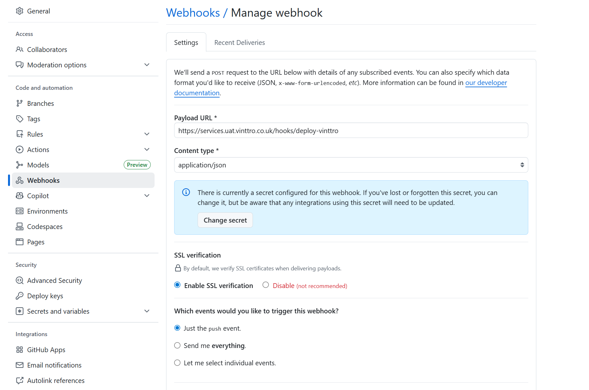

# VINTTRO Code deployment

### Overview
This document describe the deployment process for the bespoke VINTTRO code, 


### Git hub triggers
Currently deploying from git hub via a webhook onto the vm, where the vm is running a webhook service that is exposed via the nginx server.
---

### UAT
#### Github Setup

https://github.com/scollis1968/vinttro



#### VM setup   
Connect to the VM using the brower ssh from [google](https://ssh.cloud.google.com/)

To see what just happend
```
 sudo systemctl status webhook

```
The web hook service is config is found in /etc 
```
root@instance-20250904-100843:/home/stephen_collis# sudo ls -al /etc/webhook
total 20
drwxr-xr-x  2 root    root    4096 Sep 30 15:40 .
drwxr-xr-x 89 root    root    4096 Oct  6 05:06 ..
-rwxr-xr-x  1 webhook webhook 2421 Sep 30 15:40 deploy-vinttro.sh
-rw-r--r--  1 root    root     216 Sep 29 09:17 deploy.sh
-rw-r--r--  1 webhook webhook  635 Sep 30 14:19 hooks.json
```

**/etc/webhook/hooks.json** contains the decleration of the hook. It appears difficult to get github to call the hook only on specific branches,so therefore it becomes the job of the webhook service that receives the request to reject anything that is not for the appropriate branch.

```
[
  {
    "id": "deploy-vinttro",
    "arguments": [
      "{{ . | escapeSingleQuotes }}" 
    ],
    "execute-command": "/etc/webhook/deploy-vinttro.sh",
    "command-working-directory": "/tmp",
    
    "secret": "63f4945d921d599f27ae4fdf5bada3f1",
    "trigger-rule": {
      "and":
      [
        {
           "match":
           {
             "type": "value",
             "value": "refs/heads/uat",
             "parameter":
             {
               "source": "payload",
               "name": "ref"
             }
           }
        }
      ]
    },
    "response-message": "VINTTRO Deployment script triggered."
  }
]
```

** /etc/webhook/deploy-vinttro.sh **
As you can see if the hook satisfies all it's rules then it will execuute the deploy-vinttro.sh cammand that will checkout the appropriate branch and then sync the new files into the appropriate directories.

## N.B. If you add additional instructions dont forget to add then to /etc/sudoers
## N.B. In /var/www/suitecrm edit compser.json and set "vlucas/phpdotenv": "^5.0", and run  sudo -u www-data composer install


##

# setup the wp cli on both machines
    ```
    curl -O https://raw.githubusercontent.com/wp-cli/builds/gh-pages/phar/wp-cli.phar
    php wp-cli.phar --info
    chmod +x wp-cli.phar
    sudo mv wp-cli.phar /usr/local/bin/wp
    ```

# Setting up ssh permissions from Prod to UAT


The v-sysnc.sh script will be executed as the webhook user and will beed to have ssh access to the UAT VM to grab the latest images and sql

1. Make sure the webhoot home directory exists

    ```
    eval echo "~webhook"
    ```

1. Create the home directory and set the permission
    ```
    # Create the home and .ssh directory
    sudo mkdir -p /home/webhook/.ssh

    # Set the webhook user as the owner
    sudo chown -R webhook:webhook /home/webhook

    # Set the strict permissions SSH requires
    sudo chmod 700 /home/webhook/.ssh
    ```
1. Create the ssh key
    ```
    sudo -u webhook ssh-keygen -t ed25519 -N "" -f /home/webhook/.ssh/id_ed25519
    ```
1. Copy the contents from  /home/webhook/.ssh/id_ed25519.pub to the UAT box and give the webhook user bash so it can run commands.
    ```
    sudo nano /nano /home/webhook/.ssh/authorized_keys
    sudo chsh -s /bin/bash webhook
    ``` 
1. Test the ssh Connection 
    ```
 sudo -u webhook ssh -i /home/webhook/.ssh/id_ed25519 -o StrictHostKeyChecking=no webhook@10.154.0.3 'echo Connection Successful'
    ```
    
Step 1: Give the Webhook user "Group Write" power
On your Production VM, run these commands:

Bash
# 1. Add webhook user to the web server group
sudo usermod -aG www-data webhook

# 2. Make the uploads folder group-writable so webhook can update them
sudo chmod -R g+w /var/www/wordpress/wp-content/uploads/

# 3. Ensure the folder has the "SetGID" bit (new files will keep the correct group)
sudo chmod g+s /var/www/wordpress/wp-content/uploads/